# Scraping Twitter:

## Tables: 
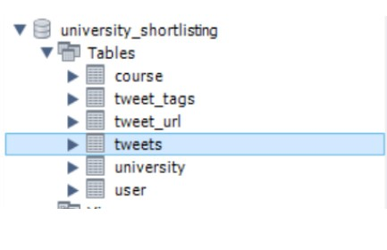

## 15 Questions (5 each team member):
1. Search universities that provide DS courses.

Description : A student searches for universities that provide DS courses.

Actor : Student.

Pre-condition: To seek admission in college, a student will shortlist his universities. 

Steps : 

Actor action : User searches a database 

System Response :  If the database is available then the user can view and shortlist the university as per requirements. And the use case ends 

Post-Condition : Users successfully shortlist the universities.

Alternate part : The db is not available and the user has to search all over again.
	
SQL Query :  

    select * from University where course = "Data Science";

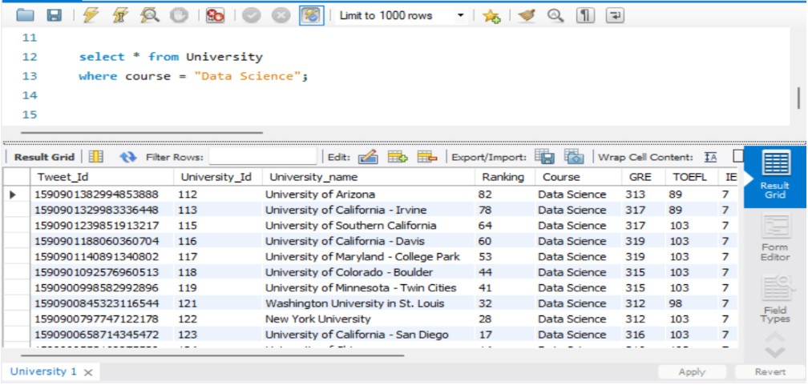
	
Relational Algebra:

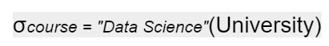

2. Search for the top 3 universities.

Description : A student searches for universities based on their ranking .

Actor : Student.

Pre-condition: To find the best university student searches for top 3 universities. 

Steps : 

Actor action : User searches a database 

System Response :  If the database is available then the user can view the top universities . And the use case ends 

Post-Condition : Users successfully fetch top universities.

Alternate part : The database is not available and the user has to search all over again.
	
SQL Query :  
    
    select * from University order by ranking asc limit 3

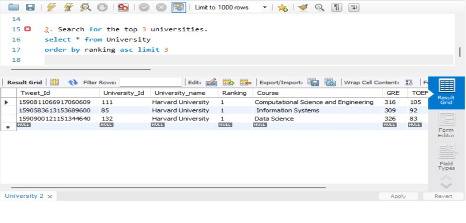

3. Search for the universities with fees less than 20000.

Description : A student searches for universities with fees less than 20000.

Actor : Student.

Pre-condition: To find the universities which are economical.

Steps : 

Actor action : User searches a list of universities.

System Response :  If the list is available then the user can view the universities as per the requirements. And the use case ends 

Post-Condition : Users successfully fetch economic universities.

Alternate part : The list is not available and the user has to search each university manually .
	
SQL Query : 
    
    select * from University where fees < 20000;

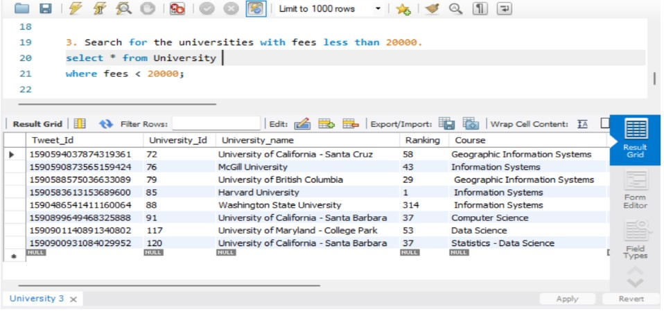

Relational Algebra:

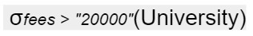

4. Universities which does not requires GPA greater than 3.5

Description : A student searches for universities with GPA less than 3.5.

Actor : Student.

Pre-condition: To find the universities which require GPA less than 3.5. 

Steps : 

Actor action : User searches a list of universities.

System Response :  If the list is available then the user can view the universities as per the requirements. And the use case ends 

Post-Condition : Users successfully fetch universities.
Alternate part : The list is not available and the user has to search each university manually.
	
SQL Query : 
    
    select University_Id, University_name, Course, GPA, University_link from University where GPA < 3.5;

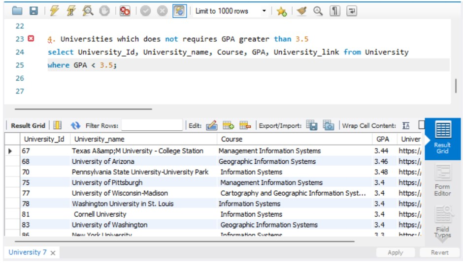
	
Relational Algebra:

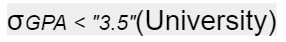

5. A university which accepts a score less than 90.

Description : A student searches for universities with a TOEFL score less than 90.

Actor : Student.

Pre-condition: To find the universities which accepts a TOEFL score less than 90

Steps : 

Actor action : User searches a list of universities.

System Response :  If the list is available then the user can view the universities as per the requirements. And the use case ends 

Post-Condition : Users successfully fetch universities.
Alternate part : The list is not available and the user has to search each university manually.
	
SQL Query : 
    
    select University_Id, University_name, Course, TOEFL, University_link from University  where TOEFL < 90; 

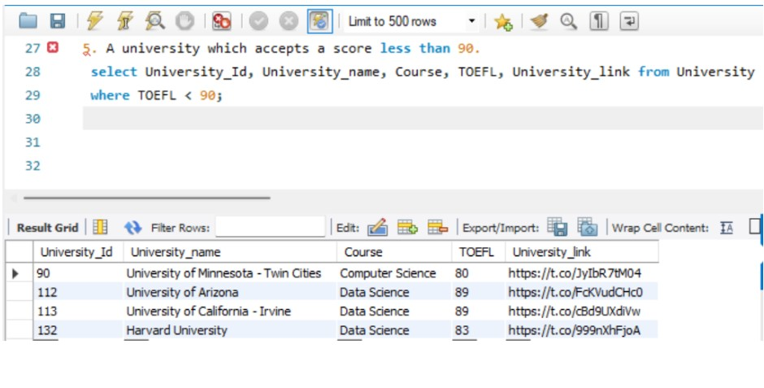

Relational Algebra:

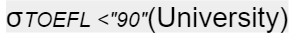

6. University accepting average educational profile.
Description : A student with an average educational profile is searching for a university.

Actor : Student.

Pre-condition: To find the universities which accepts a TOEFL score less than 95, GPA score less than 3.5 and GRE 315

Steps : 

Actor action : User searches a list of universities.

System Response :  If the list is available then the user can view the universities as per the requirements. And the use case ends 

Post-Condition : Users successfully fetch universities.

Alternate part : The list is not available and the user has to search each university manually .
	
SQL Query : 
    
    select University_Id, University_name, GRE, TOEFL, GPA from University where gpa <3.5 && GRE<315 && TOEFL<95;

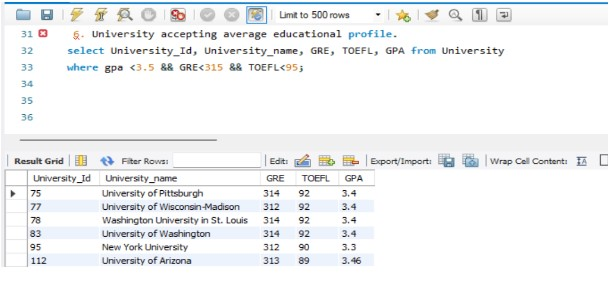

Relational Algebra:

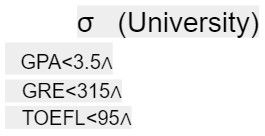

7. University name starting from ‘U’ and sorted by ranking.
Description :A student searching for a university starting with a U letter and sorted by ranking.

Actor : Student.

Pre-condition: Student is unable to remember that name of the university and tries to find it based on the first letter and decides to sort the list based on ranking.

Steps : 

Actor action : User searches a list of universities.

System Response :  If the list is available then the user can view the universities starting with an alphabet and sorted based on the ranking. And the use case ends 

Post-Condition : Users successfully fetch universities.

Alternate part : The list is not available and the user has to search each university manually .
	
SQL Query :
    
    Select University_name from University where University_name like 'U%' order by ranking asc;

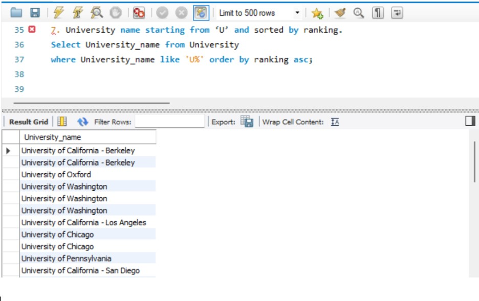

8. University with lowest cost of living along with the best ranking.

Description :A student searching for a university with lowest cost and best ranking.

Actor : Student.

Pre-condition: Student is trying to find a economic university with the best ranking

Steps : 

Actor action : User searches a list of universities.

System Response : If the list is available then the user can view the university which has the lowest cost of living and the best ranking.

Post-Condition : Users successfully fetch universities.

Alternate part : The list is not available and the user has to search each university manually .
	
SQL Query : 
    
    Select University_name, min(ranking), min(cost_of_living) from University

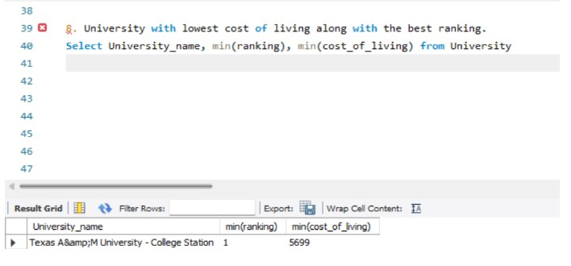

9. University with low fees and good return of interest.
Description :A student searching for a university with low fees and good ROI

Actor : Student.

Pre-condition: Student is trying to find a economic university with the good ROI

Steps : 

Actor action : User searches a list of universities.

System Response : If the list is available then the user can view the universities which have low fees and good ROI.

Post-Condition : Users successfully fetch universities.
Alternate part : The list is not available and the user has to search each university manually.
	
SQL Query : 
    
    Select * from University order by fees asc, Average_salary desc;

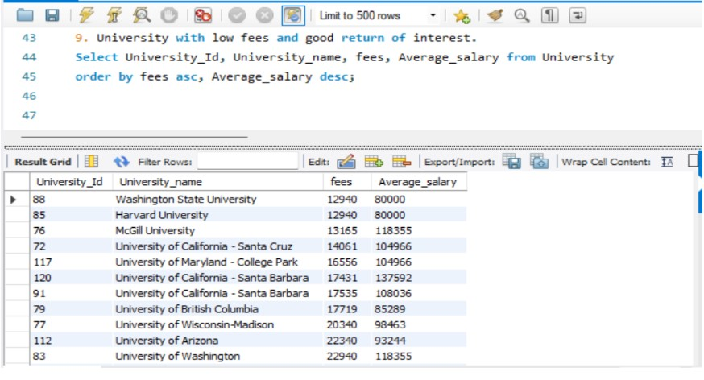

10. Finding the latest tweets related to the university

Description : To find the latest updates.

Actor : User.

Pre-condition: User is trying to find the latest tweets.

Steps : 

Actor action : User searches the latest updates on twitter 

System Response : If the list is available then the user can view the latest tweets.

Post-Condition : Users successfully fetch tweets.

Alternate part : The list is not available and the user has to search each university manually.

SQL Query : 
    
    select tweets.tweet_id, tweets.tweet_text tweets.created_date,university.university_name from tweets left join university on tweets.tweet_id = university.tweet_Id where university.University_name = 'University of Arizona' order by created_date desc;

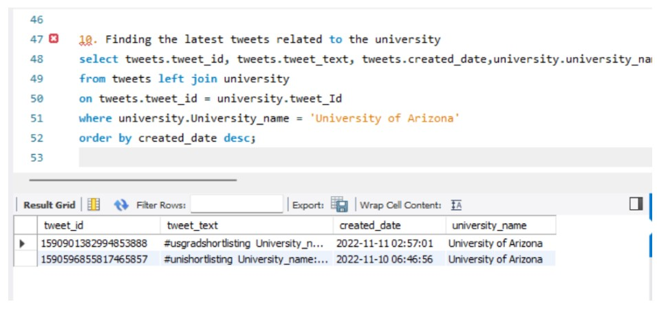

11. Search for universities which rank between top 20-30.

Description: User searches for universities ranked between 20-30.

Actor: User.

Pre-Condition: To seek admission in college, a student will view his universities.

Steps: 

Actor action: user searches database.

System response: The list of universities is displayed for certain ranking.

Post condition: System displays the list of universities for the condition.

Alternate path: No universities found.

Error: The university's data not available.

SQL Query : 

    select * from University where ranking BETWEEN 20 and 30;

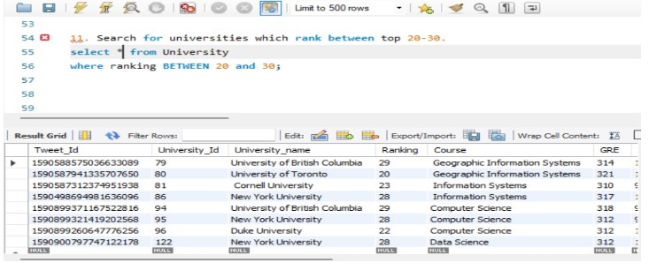

12. View the universities which has CGPA cutoff of 3.5 and above

Description: User views the universities with 3.5 cutoff.

Actor: User.

Pre-Condition: To find the universities which accepts a GPA score more than 3.5

Steps: 

Actor action: user views the universities above particular CGPA.

System response: The universities above a particular CGPA are displayed.

Post condition: System displays the universities for the condition.

Alternate path: No universities found.

Error: The universities data not available.

SQL Query : 

    select * from university where GPA >= 3.5;

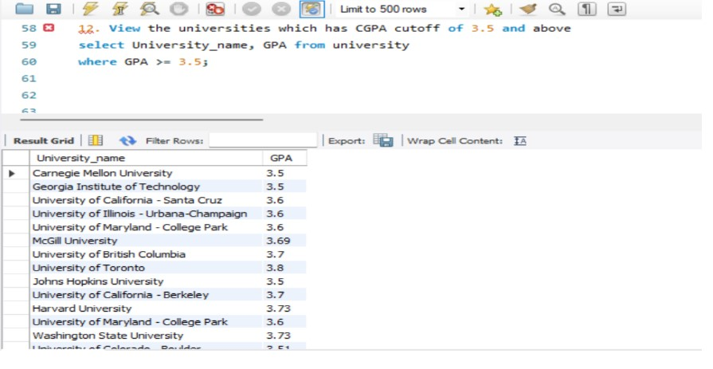

13. View the universities which offer course of “Computer science and engineering”.

Description: User searches for universities which provide Computer science and engineering courses.

Actor: User

Pre-Condition: To seek admission in university, user will view this Universities list.

Steps:

Actor action: User views the universities for a particular course.

System response: The list of universities offering this course are displayed.

Post condition: System displays the list of universities for the condition.

Alternate path: No universities found.

Error: The universities data not available.

SQL Query : 

    select * from University where course = 'Computer science and Engineering';

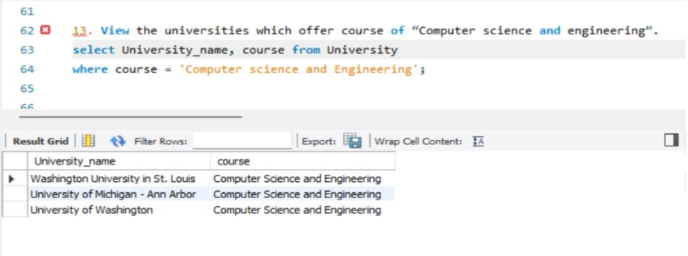

14. View the course which has requirements of IELTS>7.0 band.

Description: User searches for courses which has IELTS>=7 requirement.

Actor: User

Pre-Condition: To find the universities which accepts a IELTS score more than or equals to 7

Steps:

Actor action: User views the courses for a particular requirement.

System response: The list of courses is displayed.

Post condition: System displays the list of courses for the requirement.

Alternate path: No courses found.

Error: The course data not available.

SQL Query : 

    select * from university where IELTS >= 7;

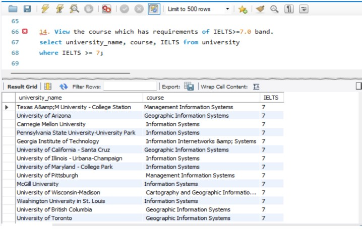

15. View the twitter username for the tweets related to Princeton University.

Description: User searches for twitter username who tweeted in relation to Princeton University.

Actor: User

Pre-Condition: User wants to seek admission at Princeton University

Steps:

Actor action: User views the twitter username for the tweet.
System response: The twitter username is displayed.

Post condition: System displays the twitter username of the tweet.

Alternate path: No Twitter username found.

Error: The tweet is not available.

SQL Query:

    select tweeter_handle from tweets left join university on tweets.tweet_Id = university.tweet_Id where university.University_name = 'Princeton University';

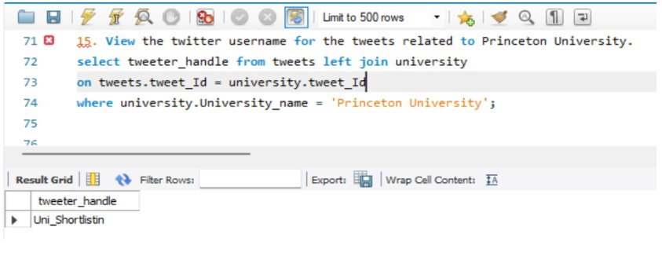

## Questions in assignment:
1. What user posted this tweet?

SQL : 

    select tweets.tweeter_handle from tweets left join tweet_url 
    on tweets.Tweet_Id = tweet_url.tweet_Id  where tweet_url.url = 'https://twitter.com/Uni_Shortlistin/status/1590597710973140993';

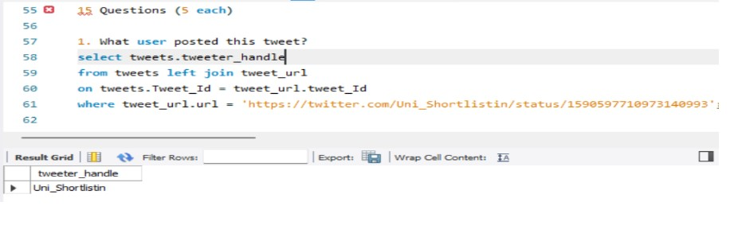

2. When did the user post this tweet?

SQL : 

    select tweets.created_date from tweets left join tweet_url on tweets.Tweet_Id = tweet_url.tweet_Id where tweet_url.url = 'https://twitter.com/Uni_Shortlistin/status/1590597710973140993';

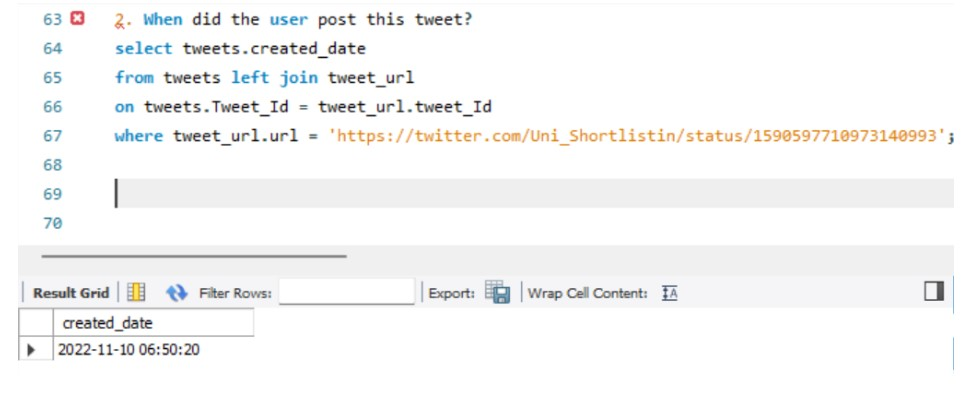

3. What tweets have this user posted in the past 24 hours?

SQL:

    select * from tweets where tweeter_handle = 'Uni_Shortlistin' && created_date > '2022-11-10 05:54:19';

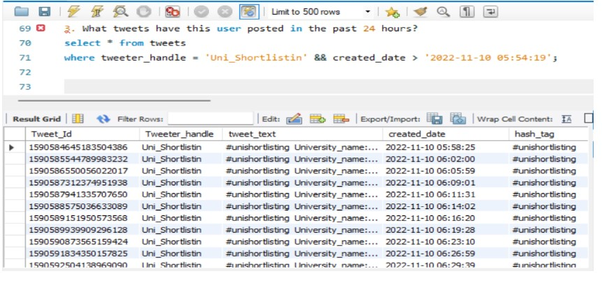

Relational Algebra:

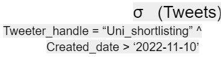

4. How many tweets have this user posted in the past 24 hours?

SQL : 

    select count(tweet_id) from tweets where tweeter_handle = 'Uni_Shortlistin' && created_date > '2022-11-10 05:54:19';

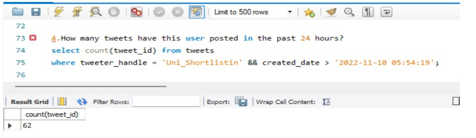

5. When did this user join Twitter?

SQL : 

    select Account_created_on from user where tweeter_handle = 'Uni_Shortlistin';

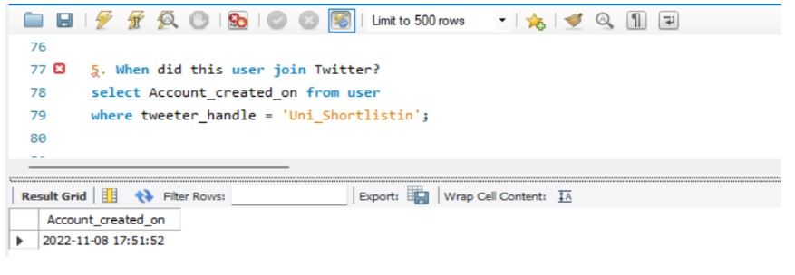

Relational Algebra:

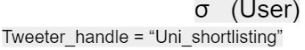

6. What keywords/ hashtags are popular?

SQL : 

    select hash_tag, count(hash_tag) as frequency from tweets group by hash_tag order by count(hash_tag) desc;

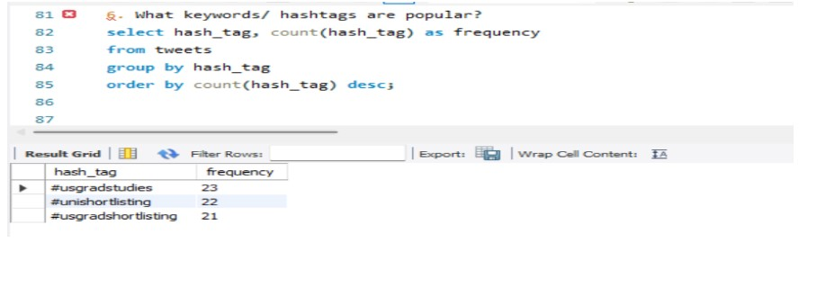
